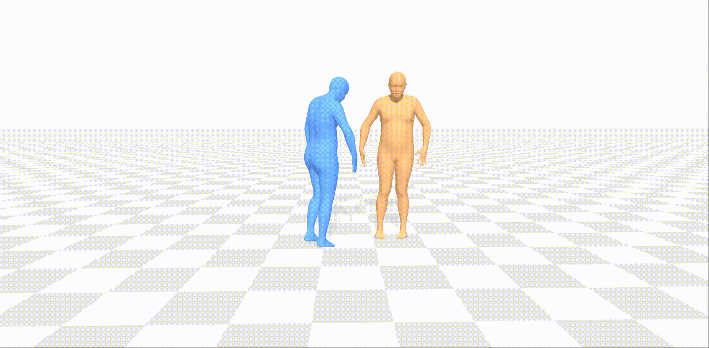

# xxx


## Instruction

dsadsad


## demo

edit:



<div style="display: flex; justify-content: space-between;">
  <div style="flex: 1; margin-right: 10px;">
    
    
  </div>
  <div style="flex: 1;">
    
    
  </div>
</div>


## Getting started

This code was tested on `windows 10` and requires:

* Python 3.10
* conda3 or miniconda3
* CUDA capable GPU (one is enough)

### 1. Setup environment


## xxx Synthesis
<details>
  <summary><b>xxxxxx</b></summary>


### Generate

```shell
python -m scripts.generate 
```
</details>

**Running those will get you:**

* `results.npy` file with text prompts and xyz positions of the generated animation

It will look something like this:


You can stop here, or render the SMPL mesh using the following script.

### Render SMPL mesh

To create SMPL mesh per frame run:

```shell
python -m scripts.visualize.render_mesh --input_path /path
```

## Applications

* In order to use it, you need to acquire the full data.


### editing

Just add the text conditioning using `--xxx`. For example:

```shell
python -m scripts.edit 
```

The output will look like this (blue joints are from the input motion; orange were generated by the model):


## Train your own model

<details>
  <summary><b>xxxxxx</b></summary>

**xxxxxx**
```shell
python -m train --save_dir save --dataset xxxxxx
```

</details>

## Evaluate

<details>
  <summary><b>xxxxxx</b></summary>

* Takes about 20 hours (on a single GPU)

**xxxxxx**
```shell
python -m eval.eval --model_path ./save/model.pt
```
</details>


## Bibtex
If you find this code useful in your research, please cite:

```
@inproceedings{

}
```


## Acknowledgments

This code is standing on the shoulders of giants. We want to thank the following contributors
that our code is based on:


## License
This code is distributed under an [MIT LICENSE](LICENSE).

Note that our code depends on other libraries, including CLIP, SMPL, SMPL-X, PyTorch3D, and uses datasets that each have their own respective licenses that must also be followed.